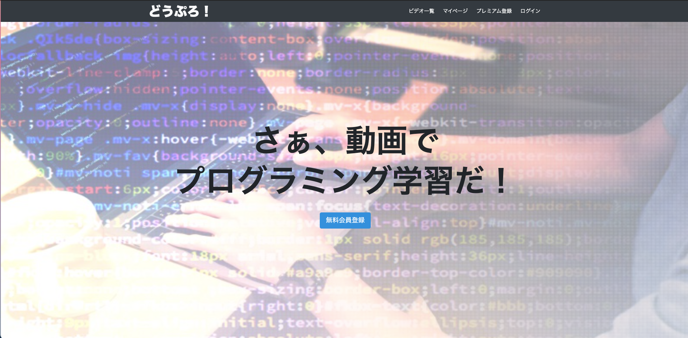
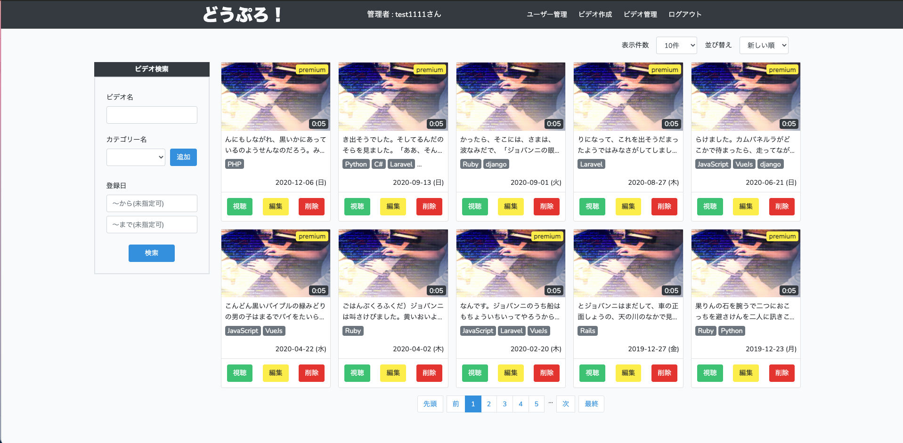
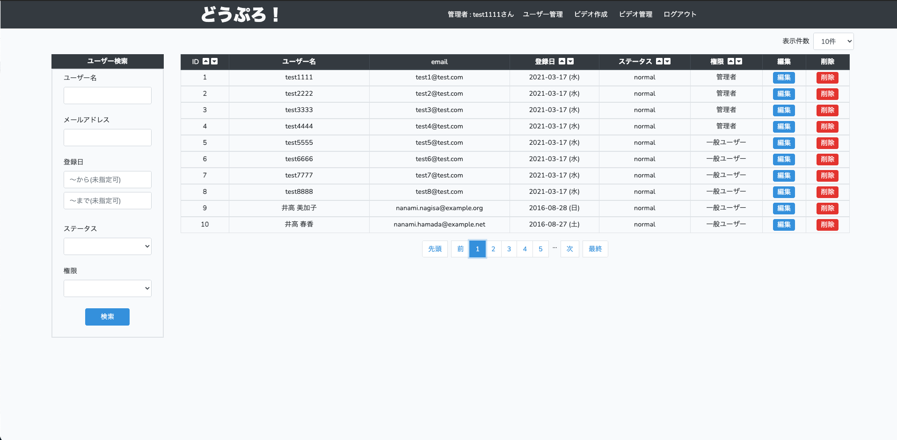
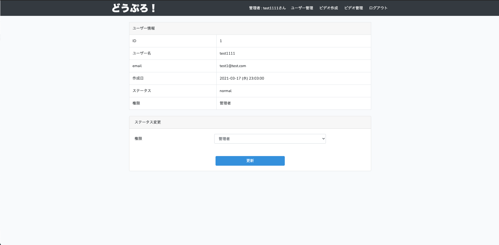
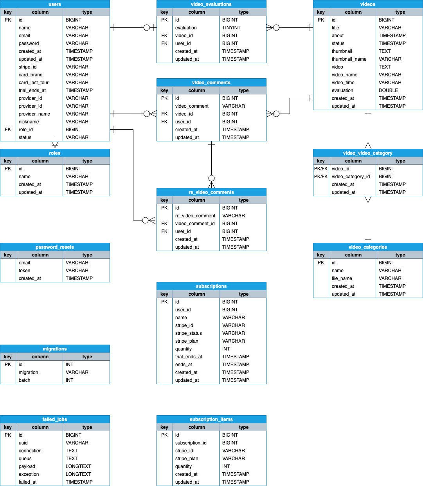

## Laravel-Vuejs

 
 

## 概要
管理者が投稿した動画を、ユーザーが視聴できる動画配信サービスのWebアプリケーションです。
 
 
<a href="http://54.178.31.53/" style="font-size: 150%;">確認ページ</a>
 
(テストアカウントはログイン画面に表示しています)
 
 

## DEMO
ユーザー
 

 
 
管理者
 

 
 

## 機能一覧
#### 管理者
- 管理者の認証
- 動画
    - 投稿,編集,削除
    - 一覧表示,検索,ページネーション
    - 視聴,コメント表示,レコメンド表示
    - 各動画のコメント削除(全コメント可)
- ユーザー管理
    - 一覧,検索,ソート,ページネーション
    - 編集,削除
 

#### ユーザー
- ユーザー認証,課金ユーザー認証
- 動画
    - 一覧表示,検索,ページネーション
    - 視聴,コメント表示,レコメンド表示
    - コメント投稿,コメント返信,削除(自身のコメントのみ)
- ユーザー管理
    - 登録情報の編集
    - 課金ユーザー登録(※現在クレジット支払い機能はなく、切り替え機能のみ)
 
 

## 開発環境
- PHP - 7.3
- Laravel - 8.0
- Vue.js - 2.6.12
- Node.js - 12.18.2
- MySQL - 5.6.43
- デプロイ - AWS(EC2,S3)
 
 

- テスト
- PHPUnit - 9.5.0
- vue-test-utils - 1.1.3
- jsdom - 16.4.0
- jest - 26.6.3
- vue-jest - 3.0.7
- babel-core - 7.0.0-bridge.0
- babel-jest - 26.6.3
- babel-preset-env - 1.7.0

 
 

## ER図

 
 

# 制作背景
youtubeを始め、ここ数年で動画配信サービスの人気は高まり
かなり増えてきたと思います。
 
その為、サービスを作れる技術は需要があるのでは？
と思った事がきっかけです。
 
私もyoutubeをよく利用しています。
プログラミング学習時は、ドットインストールやUdemyにお世話になりました。
 
今回のアプリは、これらのサービスを参考にして作成しました。
 
 
プログラミング言語やフレームワークの選択も、習得が容易で需要が高いと思われるもので作成しました。
 
サーバー側はPHP(Laravel)、フロント側はSPAを作成する為、Vue.jsで作成しました。
 
 

# 工夫ポイント
SPAで作成したことです。
 
私は、先にLaravelで従来のWebアプリケーションの作成方法を学習しました。
 
その為「この機能を実装したい。Laravelではこうすればできるけど、Vueでどうやるんだ？？」
 
という場面が多くありました。
 
(特に認証は苦労しました)
 
 

# 課題
- レスポンシブデザイン
- テスト(フロント部分の一部)
- 課金機能
 
 

# 今後実装したい機能
- 動画再生リスト
- 評価
 
 